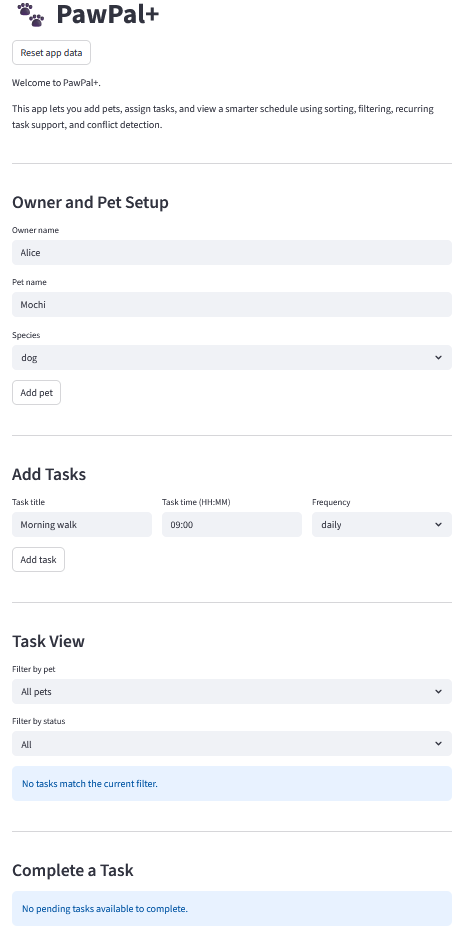

# PawPal+ (Module 2 Project)

**PawPal+** is a Streamlit app that helps a pet owner plan care tasks for their pet.

## Scenario

A busy pet owner needs help staying consistent with pet care. They want an assistant that can:

- Track pet care tasks (walks, feeding, meds, enrichment, grooming, etc.)
- Consider constraints (time available, priority, owner preferences)
- Produce a daily plan and explain why it chose that plan

## Getting started

### Setup

```bash
python -m venv .venv
source .venv/bin/activate  # Windows: .venv\Scripts\activate
pip install -r requirements.txt
```
## Smarter Scheduling

To improve PawPal+, I added smarter scheduling features:

1. Sorting Tasks: Tasks can  be sorted by time to create a clear daily schedule.
2. Filtering Tasks: Tasks can be filtered by pet name or completion status, which makes it easier to view specific tasks.
3. Recurring Tasks: Tasks with a frequency like "daily" or "weekly" automatically generate a new task when completed.
4. Conflict Detection: The system detects scheduling conflicts when multiple tasks have the same due date and time.

## Testing PawPal+

Run the test suite using:
python -m pytest

These tests cover the core functionality of the PawPal+ system such as  task creation and completion, adding tasks to pets, and verifying that task lists update correctly. They also test the scheduling logic by making sure tasks are sorted in chronological order and do not modify the original data. Recurring task behavior is also verified and it is checked that non-recurring tasks do not create additional entries. Lastly, the tests check conflict detection by comparing outputs for tasks that occur at the same date and time and for those that do not.

Based on the test case results, my confidence Level is 4.5/5 regarding the system’s reliability because all 20/20 test cases that cover both happy cases along with edge cases passed successfully. However, there may still be more complex scenarios that have not been fully tested.

## Features

- **Task management** — Create care tasks for your pets with a description, scheduled time, frequency (daily, weekly, etc.), and due date. Mark tasks as complete when done.

- **Multiple pets** — An owner can have multiple pets, each with their own independent list of tasks.

- **Time-sorted schedule** — View all pending tasks sorted chronologically by time, so you always know what's coming up next.

- **Filter tasks** — Look up tasks by pet name, completion status, or both at once (e.g., "show me Kitty's pending tasks").

- **Recurring tasks** — When you complete a daily or weekly task, the scheduler automatically creates the next occurrence with the correct due date.

- **Conflict detection** — The scheduler flags any two tasks scheduled at the same date and time, so you can spot and resolve clashes before they happen.

- **Daily schedule view** — Display a clear, pet-by-pet overview of all incomplete tasks for the day.

## Demo

<a href="demo.png" target="_blank">
  
</a>